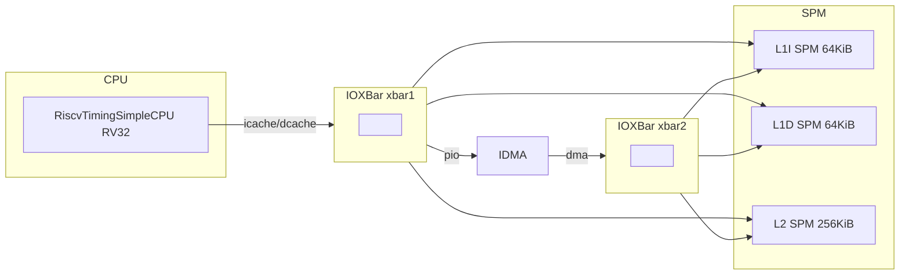

# Zircon-ManyCoreXtension
The repo is built for version control for many core system development

## Architecture in hybrid_memory

`hybrid_memory.py` uses two IOXBar buses to connect the CPU, SPMs, and IDMA. Address mapping and connections are as follows.

### Address map

| Component   | Base address | Size    | Description        |
|-------------|--------------|---------|--------------------|
| L1I SPM     | 0x80000000   | 64 KiB  | Instruction/code   |
| L1D SPM     | 0x80010000   | 64 KiB  | Data               |
| L2 SPM      | 0x80020000   | 256 KiB | Level-2 SPM        |
| IDMA regs   | 0x80060000   | 4 KiB   | DMA control regs   |

### Topology

```
                         ┌──────────────────────────────────────────────────────────┐
                         │                    IOXBar (xbar1)                        │
   cpu.icache_port ─────►│  CPU accesses L1I / L1D / L2 SPM and IDMA via this bus   │
   cpu.dcache_port ─────►│                                                           │
                         └───────────────┬───────────┬───────────┬───────────────────┘
                                         │           │           │
                                         ▼           ▼           ▼
                              ┌──────────────┐ ┌──────────────┐ ┌──────────────┐ ┌──────────────┐
                              │  L1I SPM     │ │  L1D SPM     │ │  L2 SPM      │ │  IDMA (pio)  │
                              │  64KiB @     │ │  64KiB @     │ │  256KiB @    │ │  4KiB @      │
                              │  0x80000000  │ │  0x80010000  │ │  0x80020000  │ │  0x80060000  │
                              │  port        │ │  port        │ │  port        │ └──────┬───────┘
                              └──────┬───────┘ └──────┬───────┘ └──────┬───────┘        │
                                     │                │                │                │ idma.dma
                                     │ dma_port       │ dma_port       │ dma_port       ▼
                                     │                │                │         ┌──────────────┐
                                     └────────────────┼────────────────┼────────►│ IOXBar      │
                                                       └────────────────┼────────►│ (xbar2)     │
                                                                        └────────►│ DMA bus     │
                                                                                  └──────────────┘
```

### Connections (matching the script)

- **xbar1 (CPU-side bus)**
  - **Masters:** `cpu.icache_port`, `cpu.dcache_port`
  - **Slaves:** `l1i_spm.port`, `l1d_spm.port`, `l2_spm.port`, `idma.pio`
- **xbar2 (DMA-side bus)**
  - **Master:** `idma.dma`
  - **Slaves:** `l1i_spm.dma_port`, `l1d_spm.dma_port`, `l2_spm.dma_port`

The CPU uses xbar1 to access the instruction/data SPMs, L2, and to configure the IDMA; the IDMA uses xbar2 to perform DMA transfers between L1I, L1D, and L2 SPMs.

### Mermaid diagram (optional rendering)



## How to run gem5 with SPM

**1. Rebuild gem5** (only when you change code under `src/`):

```bash
cd gem5_sim
scons ./build/ALL/gem5.opt -j8
```

**2. Build the SPM test binary and run the simulation:**

```bash
cd gem5_sim/tests/test-progs/spm_test/
make
cd ../../..
./build/ALL/gem5.opt configs/tutorial/part1/hybrid_memory.py
```

Run the last command from the `gem5_sim/` directory so the binary path `tests/test-progs/spm_test/bin/spm_test` resolves correctly.